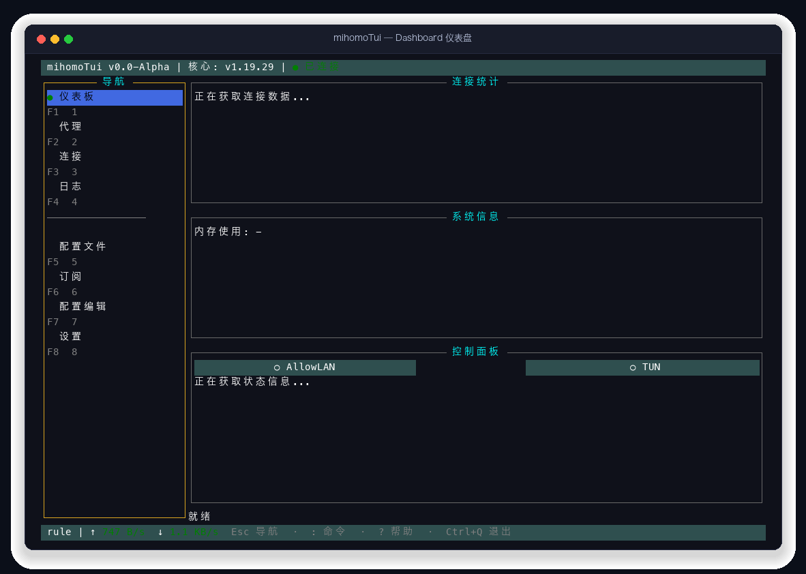
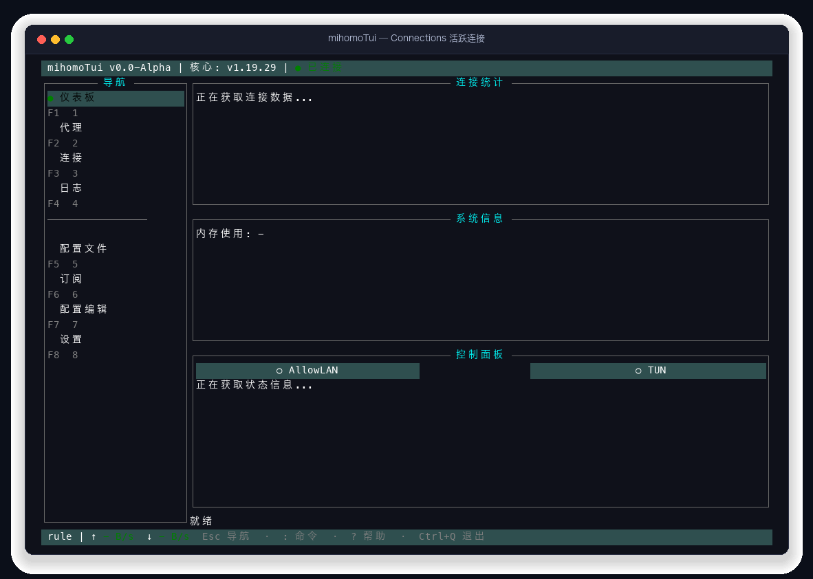
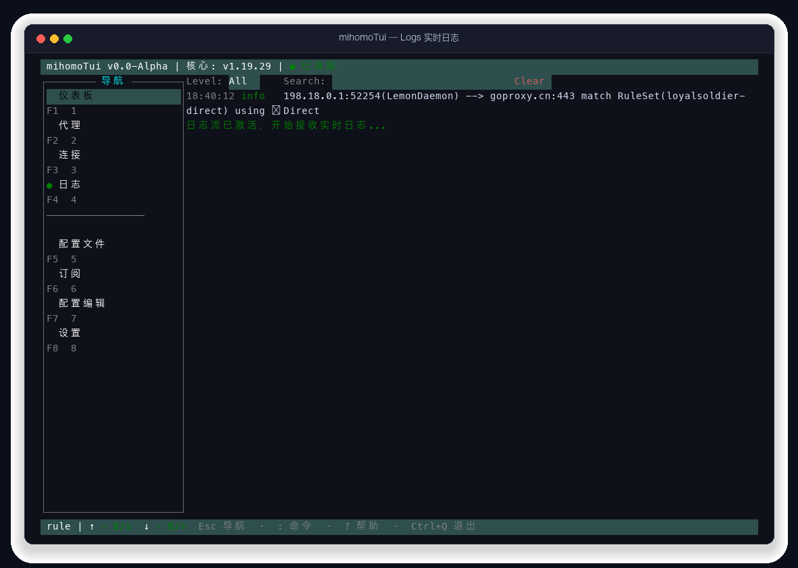
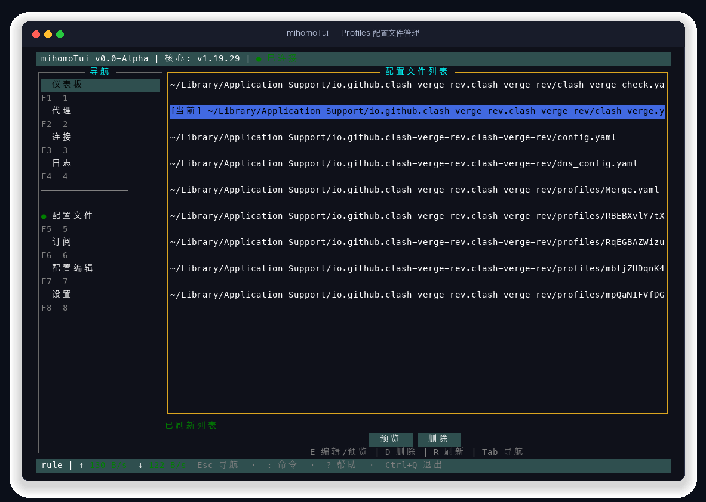
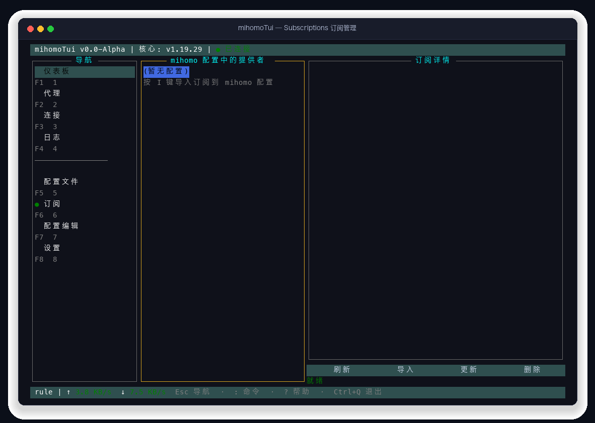
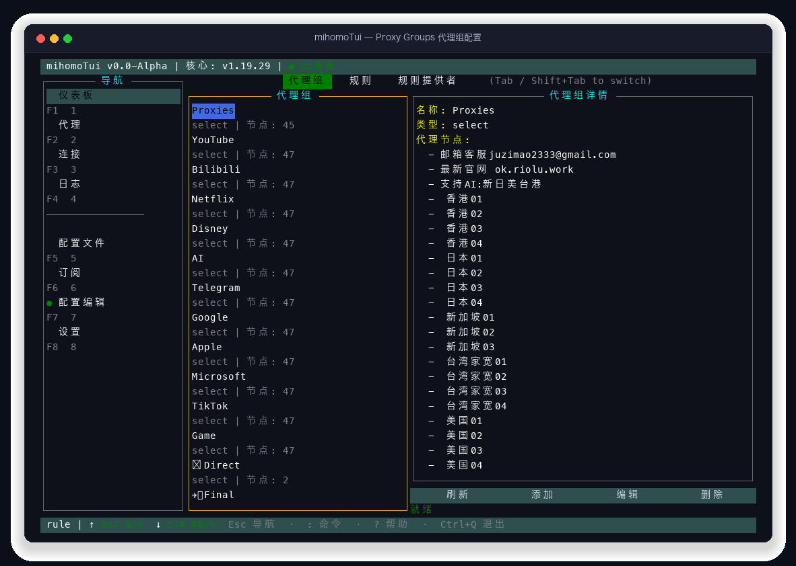
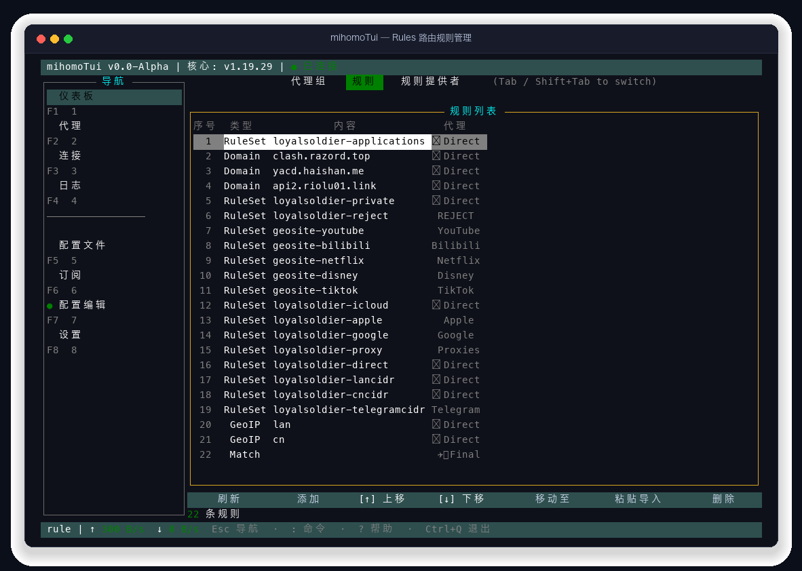
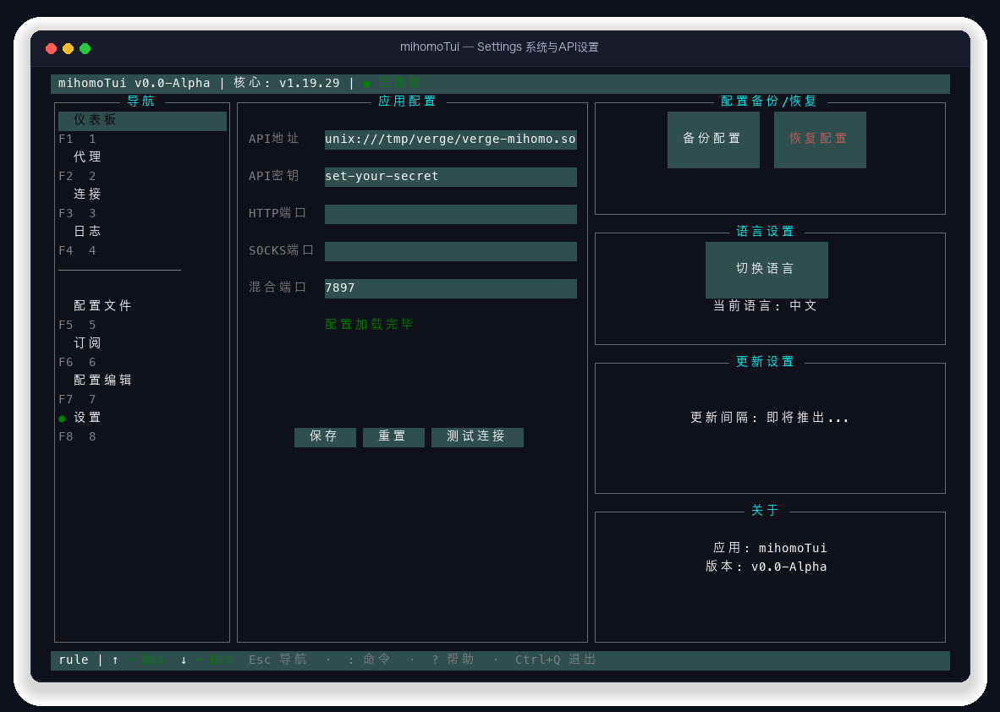
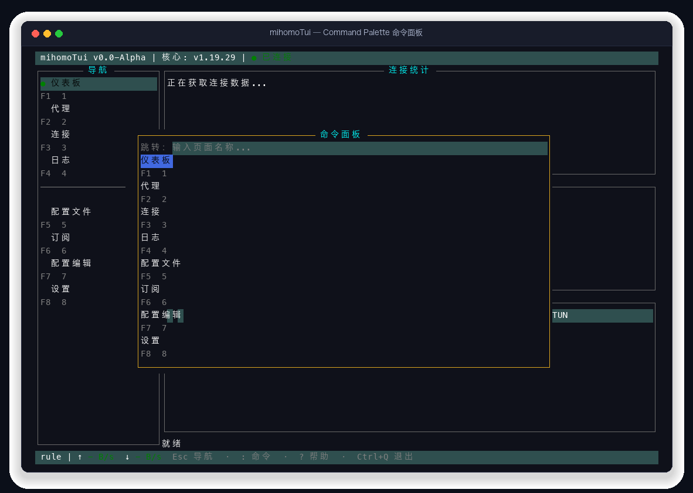
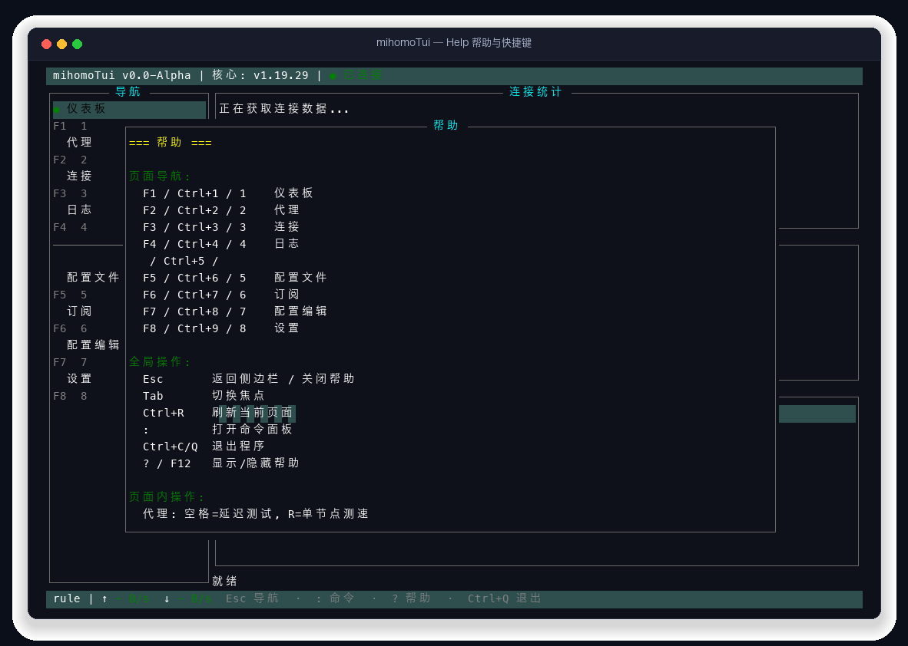

# mihomoTui - Modern Terminal UI for Mihomo

<p align="center">
  
</p>

<p align="center">
  <strong>Provide a desktop-client-grade experience directly in the terminal — a modern, responsive TUI for managing the <a href="https://github.com/MetaCubeX/mihomo">Mihomo</a> (Clash.Meta) proxy core, built with Go 1.24 and tview.</strong>
</p>

<p align="center">
  <a href="https://go.dev"></a>
  <a href="LICENSE"></a>
  <a href="https://github.com/MetaCubeX/mihomo"></a>
  <a href="#screenshots"></a>
  <a href="README_ZH.md"></a>
</p>

---

## 🌟 Key Features

- 🖥️ **Modern Desktop-Grade TUI** — Built on [tview](https://github.com/rivo/tview) with responsive flex layouts, smooth focus management, full mouse interactions, and rich 256-color / TrueColor support.
- 🌐 **Proxy & Node Management** — Real-time display of proxy providers, proxy groups, and individual nodes with batch HTTP ping latency benchmarking, instant proxy selection, and live fuzzy filtering (`/`).
- ⚡ **Core Mode & Status Control** — One-key instant toggling of `Rule`, `Global`, and `Direct` proxy modes, with TUN mode and Allow LAN sharing controls and live status bar updates.
- 📊 **Real-time Monitoring & Dashboard** — Live traffic metrics (upload/download speed meters), memory usage monitoring (Inuse / OS Limit), active connection counter, and core health indicator.
- 🔗 **Active Connections Inspector** — View all active TCP and UDP connections with full metadata (source/destination IP, ports, matched rule chains, transferred traffic, duration), keyword search filtering, single-connection termination, and batch close-all.
- 📝 **Live Streamed Logs** — Capture live Mihomo system logs via Server-Sent Events (SSE), with real-time level filtering (`debug`, `info`, `warning`, `error`), scroll tracking, and pause/resume capabilities.
- 🗂️ **Profile Management (Profiles)** — Multi-profile discovery across common system paths, hot-switching active profiles on the fly with automatic core reloading, and an in-TUI text editor for direct YAML edits with unsaved-change protection.
- 📥 **Universal Subscription Management** — Import proxy subscriptions from remote URLs or local files with built-in format auto-detection for **Clash/Mihomo YAML**, **Surge**, **Base64**, **V2Ray (vmess)**, **Shadowsocks (ss)**, **Trojan**, **Hysteria2 (hy2)**, and plain-text proxy lists, complete with UserInfo bandwidth/expiration extraction.
- 🛠️ **Unified Configuration Editor (Editor)** — Seamlessly switch across three core submodules via `Tab` / `Shift+Tab`:
  - **Proxy Groups**: Visual CRUD management for `select`, `url-test`, `fallback`, and `load-balance` groups with regex node filtering and custom health check URLs/intervals.
  - **Routing Rules**: View, add (DOMAIN, DOMAIN-SUFFIX, IP-CIDR, GEOIP, GEOSITE, RULE-SET, MATCH, etc.), edit, delete, reorder (`Alt+↑`/`Alt+↓`/`M` move-to), and batch paste-import rules.
  - **Rule Providers**: Manage behavioral rule-sets (`domain`, `ipcidr`, `classical`) from HTTP or local paths with automatic update intervals and batch import presets.
- ⚙️ **Unified System & API Settings** — Configure external-controller API endpoints and secrets with dynamic **i18n** language switching (`zh` / `en`) that updates the entire UI without requiring a restart.
- 🚀 **Command Palette** — Press `:` on any page to open a Sublime/VSCode-like fuzzy search modal for instant page jumping and command access.
- ❓ **Interactive Help Center** — Press `?` or `F12` anywhere to display a full-screen hotkey cheatsheet overlay.
- 🛡️ **Atomic & Safe File Persistence** — All configuration modifications use atomic file operations preserving Unix UID/GID permissions, backed by anti-SSRF protections.

---

## 📸 Screenshots

<table align="center">
  <tr>
    <td align="center" width="50%">
      <strong>1. Dashboard (F1)</strong><br>
      
    </td>
    <td align="center" width="50%">
      <strong>2. Proxies & Latency Test (F2)</strong><br>
      
    </td>
  </tr>
  <tr>
    <td align="center" width="50%">
      <strong>3. Connections Inspector (F3)</strong><br>
      
    </td>
    <td align="center" width="50%">
      <strong>4. Real-time Logs (F4)</strong><br>
      
    </td>
  </tr>
  <tr>
    <td align="center" width="50%">
      <strong>5. Profile Management (F5)</strong><br>
      
    </td>
    <td align="center" width="50%">
      <strong>6. Subscription Import (F6)</strong><br>
      
    </td>
  </tr>
  <tr>
    <td align="center" width="50%">
      <strong>7. Proxy Groups Editor (F7)</strong><br>
      
    </td>
    <td align="center" width="50%">
      <strong>8. Routing Rules Editor (F7)</strong><br>
      
    </td>
  </tr>
  <tr>
    <td align="center" width="50%">
      <strong>9. Rule Providers Editor (F7)</strong><br>
      
    </td>
    <td align="center" width="50%">
      <strong>10. Settings & Language (F8)</strong><br>
      
    </td>
  </tr>
  <tr>
    <td align="center" width="50%">
      <strong>11. Command Palette (:)</strong><br>
      
    </td>
    <td align="center" width="50%">
      <strong>12. Help & Keybindings (? / F12)</strong><br>
      
    </td>
  </tr>
</table>

---

## ⌨️ Keyboard Shortcuts

### Global Navigation Shortcuts

| Shortcut | Destination | Description |
|:---|:---|:---|
| `F1` / `Alt+1` / `Ctrl+1` | **Dashboard** | View traffic, memory usage, proxy mode, and core status |
| `F2` / `Alt+2` / `Ctrl+2` | **Proxies** | Select proxy nodes and perform batch latency testing |
| `F3` / `Alt+3` / `Ctrl+3` | **Connections** | Monitor active connections and terminate individual/all connections |
| `F4` / `Alt+4` / `Ctrl+4` | **Logs** | Real-time log stream display with level filters |
| `F5` / `Alt+5` / `Ctrl+5` | **Profiles** | Switch active config profiles or edit YAML in-place |
| `F6` / `Alt+6` / `Ctrl+6` | **Subscriptions** | Import subscriptions from remote URLs or local files |
| `F7` / `Alt+7` / `Ctrl+7` | **Config Editor** | Unified editor for Proxy Groups, Rules, and Rule Providers |
| `F8` / `Alt+8` / `Ctrl+8` | **Settings** | Configure API endpoints and switch UI language (zh/en) |
| `:` | **Command Palette** | Open quick fuzzy-search page navigation modal |
| `?` / `F12` | **Help Center** | Open/close interactive shortcut cheatsheet |
| `Esc` | **Focus Navigation** | Return focus from inputs to the navigation sidebar |
| `Tab` / `Shift+Tab` | **Cycle Focus / Subtabs** | Cycle between UI widgets, or switch subtabs in Editor |
| `Ctrl+C` / `Ctrl+Q` | **Quit** | Gracefully exit application |

### Page-Specific Shortcuts

<details>
<summary><strong>🔹 Rules Page Shortcuts</strong></summary>

- `A`: Open dialog to add a new rule
- `D`: Delete currently selected rule (with confirmation modal)
- `M`: Move selected rule to a specific position/line number
- `P`: Paste and bulk-import multiline rule text
- `Alt+↑` / `Alt+↓`: Shift selected rule up / down by one line
- `/`: Focus search filter box
- `R`: Reload rules from the core
</details>

<details>
<summary><strong>🔹 Proxies Page Shortcuts</strong></summary>

- `T`: Trigger HTTP ping latency speed test on active group or node
- `R`: Switch proxy mode to Rule
- `G`: Switch proxy mode to Global
- `D`: Switch proxy mode to Direct
- `/`: Focus proxy node search filter
</details>

<details>
<summary><strong>🔹 Connections Page Shortcuts</strong></summary>

- `D`: Close the selected connection
- `C` / `Shift+D`: Close all active connections
- `/`: Search connection by host, destination IP, or rule name
- `Space`: Pause / resume live connection auto-refresh
</details>

---

## 🚀 Quick Start

> 📖 For comprehensive installation instructions and troubleshooting, see [**QUICKSTART.md**](QUICKSTART.md).

### Prerequisites

1. **Go 1.24.1+** (for building from source)
2. **Terminal with UTF-8, 256-color, and mouse support** (e.g. iTerm2, WezTerm, Alacritty, Windows Terminal)
3. A running **[Mihomo](https://github.com/MetaCubeX/mihomo)** instance with `external-controller` enabled

### Method 1: Install via Go (Recommended)

```bash
go install github.com/shuideyimei/mihomoTui@latest
mihomoTui
```

### Method 2: Download Pre-built Binaries

Download the latest release archive for your platform from [GitHub Releases](https://github.com/shuideyimei/mihomoTui/releases):

```bash
# Example for macOS (Apple Silicon)
tar -zxvf mihomoTui_v0.1.0_darwin_arm64.tar.gz
./mihomoTui
```

### Method 3: Build from Source

```bash
# 1. Clone the repository
git clone https://github.com/shuideyimei/mihomoTui.git
cd mihomoTui

# 2. Download dependencies and run
go mod tidy
go run main.go
```

---

## 🛠️ Architecture Overview

The application follows a clean **3-Tier Layered Architecture** with an **Event-Driven Bus**:

```
                      ┌────────────────────────────────────────┐
                      │               main / app               │
                      └───────────────────┬────────────────────┘
                                          │
        ┌─────────────────────────────────┼────────────────────────────────┐
        ▼                                 ▼                                ▼
┌────────────────┐               ┌────────────────┐               ┌────────────────┐
│  Presentation  │ ──(Calls)────►│ Service Layer  │ ──(Invokes)──►│ Repository/Drv │
│  (tview Pages) │               │ (Rule/Group/..)│               │ (YAML / API)   │
└───────┬────────┘               └────────────────┘               └────────┬───────┘
        │ (Subscribe / Publish)                                            │ (Atomic Write)
        ▼                                                                  ▼
┌────────────────┐                                                ┌────────────────┐
│    EventBus    │ ◄───────────────────────────────────────────── │ Local Storage  │
│ (TopicProxy..) │                                                │ (config.yaml)  │
└────────────────┘                                                └────────────────┘
```

### Project Structure

```
mihomoTui/
├── main.go                          # Program entry point and log shutdown management
├── go.mod / go.sum                  # Go module definition
├── LICENSE                          # MIT License
├── static/
│   └── image.png                    # Hero overview image
├── picture/                         # High-resolution page preview screenshots
│
├── internal/
│   ├── app.go                       # Bootstrap orchestration, DI wiring, and lifecycle coordination
│   ├── hotkey.go                    # Global keyboard event dispatcher
│   ├── palette.go                   # Command Palette implementation
│   │
│   ├── api/                         # Mihomo REST API and SSE stream client
│   ├── config/                      # App config management and low-level YAML AST manipulation
│   ├── events/                      # Thread-safe decoupled EventBus
│   ├── i18n/                        # Internationalization packages (zh / en dictionaries and lookup)
│   ├── models/                      # Core domain entities (RuleDisplay, GroupEntry...)
│   ├── parser/                      # Multi-protocol subscription parsers (Clash, Surge, V2Ray...)
│   ├── repository/                  # Persistence interface abstractions and LocalYAMLDriver
│   ├── service/                     # Business services (Rule, ProxyGroup, Provider, Profile)
│   ├── subscription/                # Remote/local subscription fetcher with SSRF defense
│   ├── types/                       # Normalized configuration document types (ConfigDocument)
│   │
│   └── ui/                          # TUI core components and pages
│       ├── ui.go                    # UI thread dispatcher and modal controller
│       ├── theme.go                 # Theme color palette and styles
│       ├── navigation.go            # Navigation metadata and page routing definitions
│       ├── components/              # Reusable UI widgets (Header, StatusBar, NavBar...)
│       └── pages/                   # Feature page implementations (Dashboard, Proxies, Editor...)
```

---

## 🤝 Contributing

Contributions, issues, and feature requests are welcome!

1. Fork the Project
2. Create your Feature Branch: `git checkout -b feature/AmazingFeature`
3. Commit your Changes: `git commit -m 'feat: add some amazing feature'`
4. Run full test suite: `go test -race -count=1 ./...`
5. Push to the Branch: `git push origin feature/AmazingFeature`
6. Open a Pull Request

---

## 📄 License

Distributed under the [MIT License](LICENSE).

## 💖 Acknowledgments

- [Mihomo (MetaCubeX)](https://github.com/MetaCubeX/mihomo) — High-performance core proxy engine
- [tview](https://github.com/rivo/tview) — Rich interactive terminal UI library
- [tcell](https://github.com/gdamore/tcell/v2) — Terminal engine and screen simulation driver
